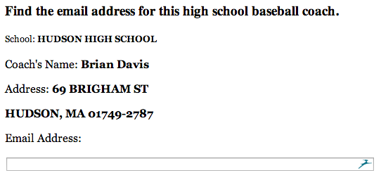
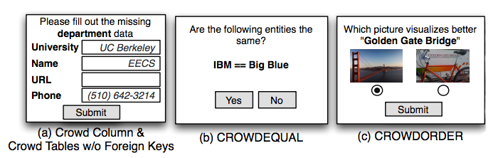
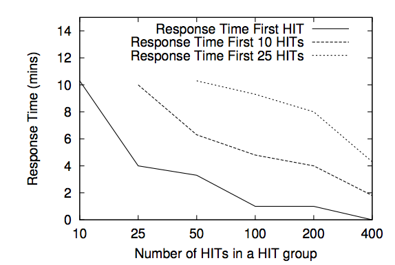
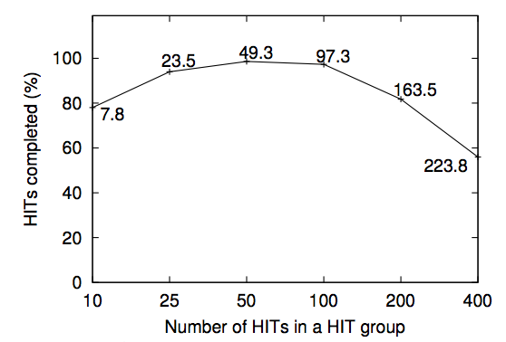
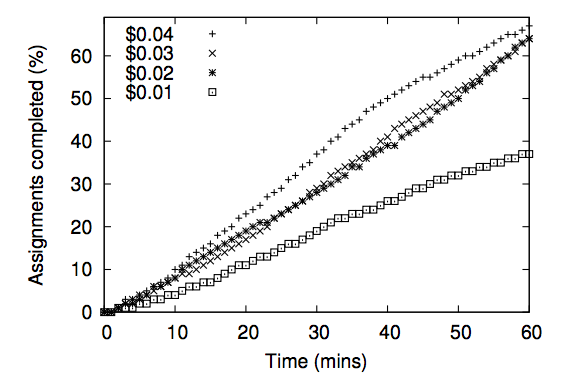
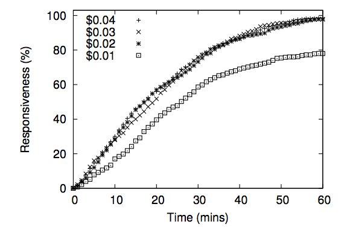
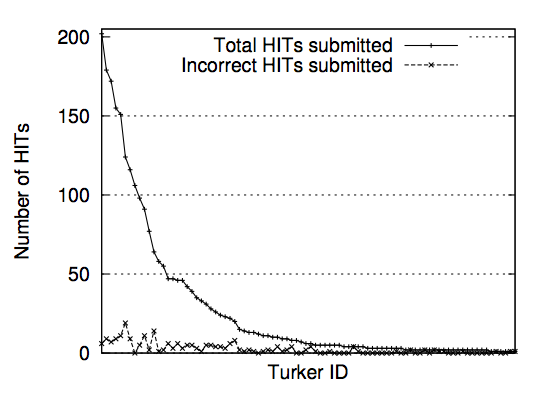

# CrowdDB
Presentation of   
Franklin et al. *CrowdDB: Answering Queries with Crowdsourcing*
--
## The problems
1. Closed world assumption
2. No tolerance for inconsistency  
---
## Crowdsourcing
* Distribute workload to a large group of people
* Small tasks with no training requirements
* Replica tasks 
--
## Amazon Mechanical Turk
* **Human Intelligent Task(HIT)** The smallest amount of work a worker can accept  
* **Assignment** A replica of a HIT  
* **HIT group** A automaticly created group of HITs  
* **Microtask** A task that require no training.
--
## Example HIT 

---
## CrowdDB
* Combines a database and AMT 
* Uses a declerative query language  
  as a interface for AMT
--
## Design consideration
* Performance and variability
* Task design and ambiguity
* Affinity and learning
* Relativly small worker pool
* Open versus closed world
--
## Architecture

--
## User interface generation
* User interface has a large impact on performance.
* CrowdDB automaticly creates UI for tasks. 
* Options are leading

--
## Problems
* Budget
* Uncorrect values (spammers)
* Outdated
---
## CrowdSQL
*A superset of SQL*
--
## CrowdSQL
* CROWD keyword
* CNULL
* CROWDEQUAL
* CROWDORDER
--
## CrowdSQL - examples

<pre><code>
    CREATE TABLE Department (
      university STRING,
      name STRING,
      url CROWD STRING,
      phone STRING,
      PRIMARY KEY (university, name)
    );
</code></pre>

<pre><code>
    CREATE CROWD TABLE Professor (
      name STRING PRIMARY KEY,
      email STRING UNIQUE,
      university STRING,
      department STRING,
      url STRING,
      FOREIGN KEY (university, department)
        REF Department(university, name)
    );
</code></pre>

--
## CrowdSQL - examples
    SELECT p FROM picture
      WHERE subject = "Golden Gate Bridge"
      ORDER BY CROWDORDER(p, "Which picture visualizes better %subject");
---
## Query Processing
* CrowdProbe
* CrowdJoin
* CrowdCompare
---
## Experiments
--
### Tuning parameters
* Response time
* Responsiveness
* Worker quality
--
### Tuning parameters

--
### Complex queries
* Entity resolution 
* Ordering pictures
* Joining on unknown values
---
## Conclusion
* <!-- Combination of human input and efficient DBMS creates--> New possibilities
* Only a proof of concept
* Fallpits
